# システムアーキテクチャ設計書

## 1. システム全体図

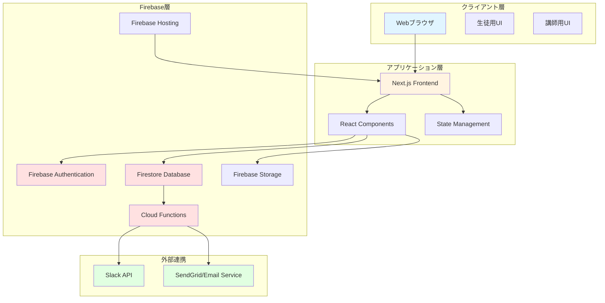

---

## 2. データベース ER図

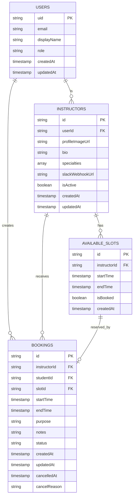

---

## 3. 認証フロー図

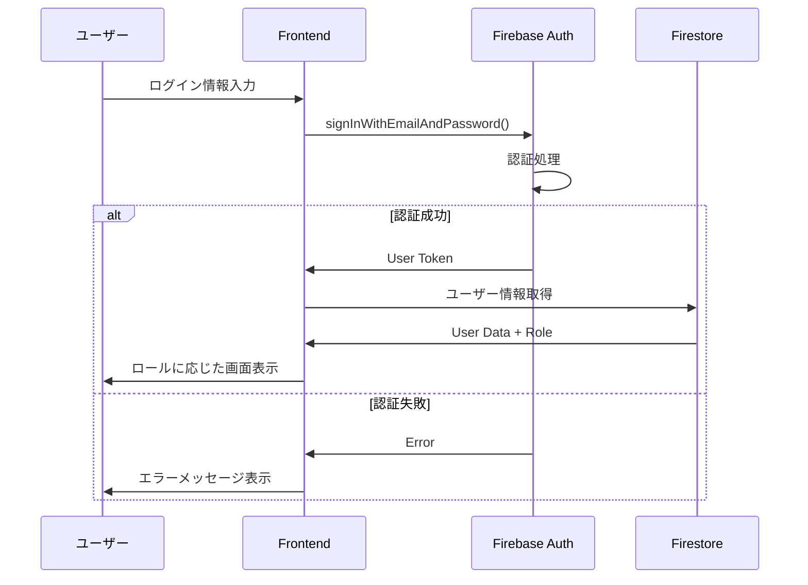

---

## 4. 予約処理フロー図

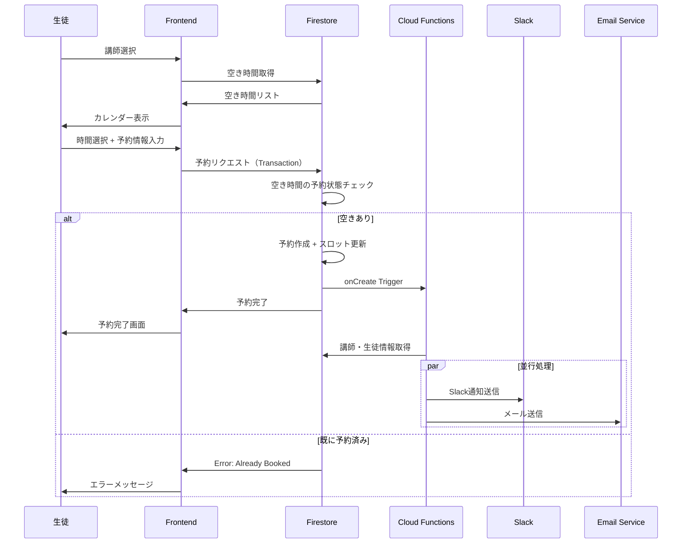

---

## 5. キャンセル処理フロー図

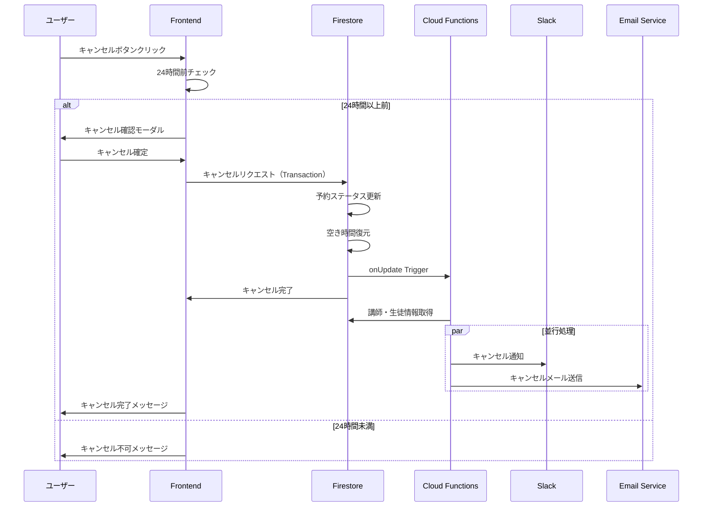

---

## 6. 画面遷移図

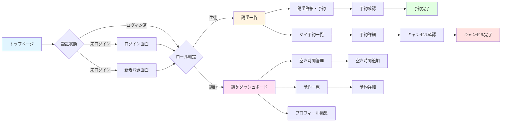

---

## 7. コンポーネント構成図

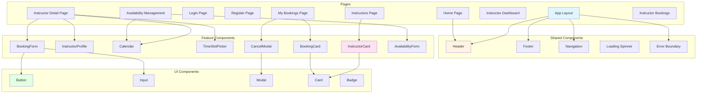

---

## 8. セキュリティアーキテクチャ

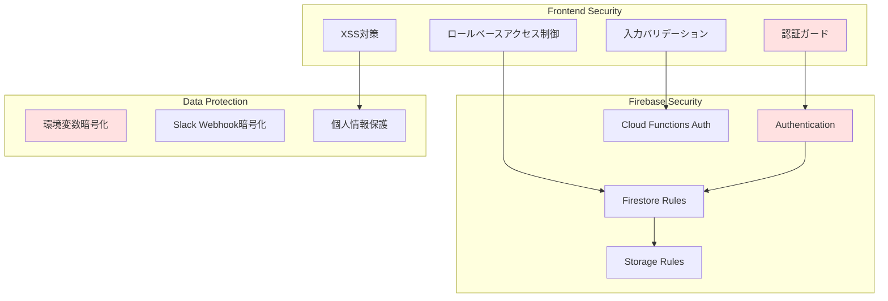

---

## 9. ローカル開発環境アーキテクチャ

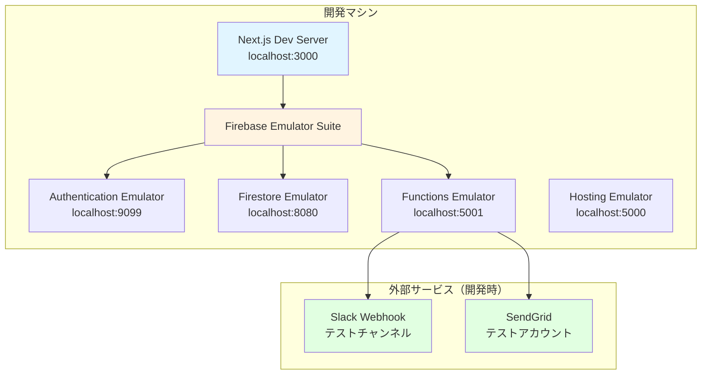

### ローカル開発の特徴：
1. **Firebase Emulator Suite**: 完全ローカルでFirebaseサービスを模擬
2. **データの永続化**: エミュレーターのデータをローカルに保存可能
3. **高速イテレーション**: 本番環境に影響を与えずに開発
4. **コスト削減**: ローカル実行のため課金なし

---

## 10. デプロイアーキテクチャ（本番環境）

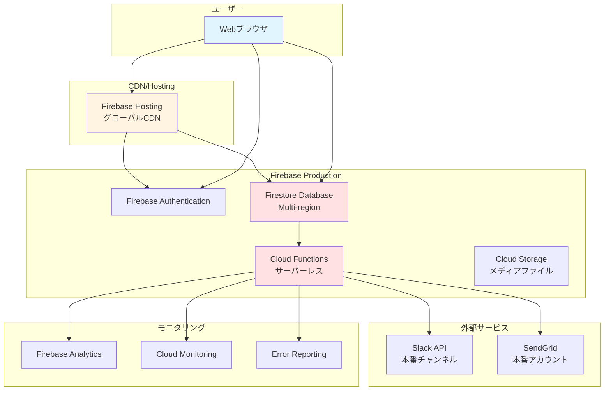

---

## 11. 技術スタック詳細

### フロントエンド
| 技術 | 用途 | 理由 |
|------|------|------|
| Next.js 14 | フレームワーク | SSR/SSG対応、高速、SEO最適化 |
| TypeScript | 型安全性 | バグ削減、開発効率向上 |
| Tailwind CSS | スタイリング | 高速開発、一貫性のあるデザイン |
| React Hook Form | フォーム管理 | パフォーマンス良好、使いやすい |
| Zod | バリデーション | 型安全なスキーマ定義 |
| react-big-calendar | カレンダー | 柔軟性が高い、カスタマイズ可能 |

### バックエンド
| 技術 | 用途 | 理由 |
|------|------|------|
| Firebase Auth | 認証 | セキュアで簡単、メール認証対応 |
| Firestore | データベース | リアルタイム同期、スケーラブル |
| Cloud Functions | サーバー処理 | サーバーレス、自動スケーリング |
| Cloud Storage | ファイル保存 | 画像アップロード用 |

### 開発ツール
| 技術 | 用途 | 理由 |
|------|------|------|
| Firebase Emulator | ローカル開発 | コスト削減、高速開発 |
| ESLint | コード品質 | 統一されたコーディングスタイル |
| Prettier | コード整形 | 自動フォーマット |
| Jest | テスト | 信頼性の高いテストフレームワーク |

---

## 12. パフォーマンス最適化戦略

### フロントエンド最適化
1. **コード分割**: 動的インポートでバンドルサイズ削減
2. **画像最適化**: Next.js Image コンポーネント使用
3. **キャッシング**: SWR または React Query でデータキャッシュ
4. **Lazy Loading**: 画面外コンポーネントの遅延読み込み

### バックエンド最適化
1. **インデックス作成**: Firestore クエリの最適化
2. **バッチ処理**: 複数のデータ操作を一括実行
3. **キャッシュ戦略**: Cloud Functions でメモリキャッシュ活用
4. **リージョン選択**: ユーザーに近いリージョンを選択

---

## 13. スケーラビリティ設計

### 現在の規模（Phase 1）
- 講師: 10名
- 想定生徒数: 100-500名
- 月間予約数: 200-1000件

### 将来の拡張性
1. **講師数増加**: 100名以上に対応可能
2. **生徒数増加**: 10,000名以上に対応可能
3. **リージョン拡大**: マルチリージョン対応
4. **機能追加**: グループMTG、ビデオ会議連携など

### Firebaseの自動スケーリング
- トラフィック増加に自動対応
- 追加の設定不要
- 従量課金で無駄なコストなし

---

## 14. 災害復旧・バックアップ戦略

### データバックアップ
1. **自動バックアップ**: Firestore 毎日バックアップ
2. **エクスポート機能**: 定期的にデータエクスポート
3. **バージョン管理**: コードのGit管理

### 障害対策
1. **マルチリージョン**: 複数リージョンでデータ複製
2. **エラーモニタリング**: リアルタイムエラー検知
3. **フォールバック**: エラー時の代替UI表示

---

## 15. 開発からデプロイまでのフロー

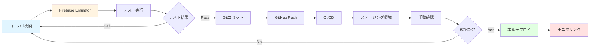

### 各段階の詳細
1. **ローカル開発**: Firebase Emulator で動作確認
2. **テスト**: ユニット・統合テスト実行
3. **ステージング**: テスト環境で最終確認
4. **本番デプロイ**: `firebase deploy` で一括デプロイ
5. **モニタリング**: Firebase Console でメトリクス確認

